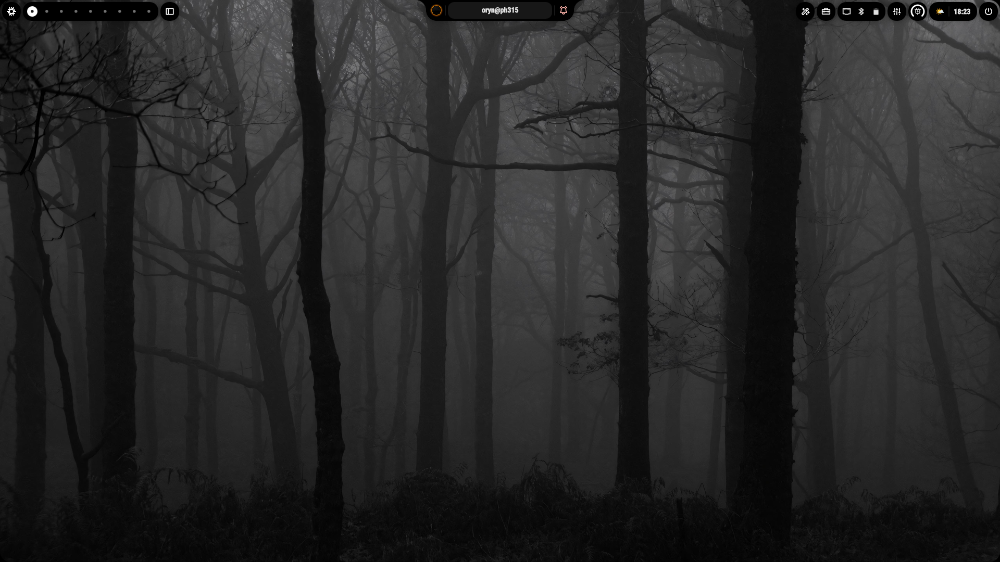
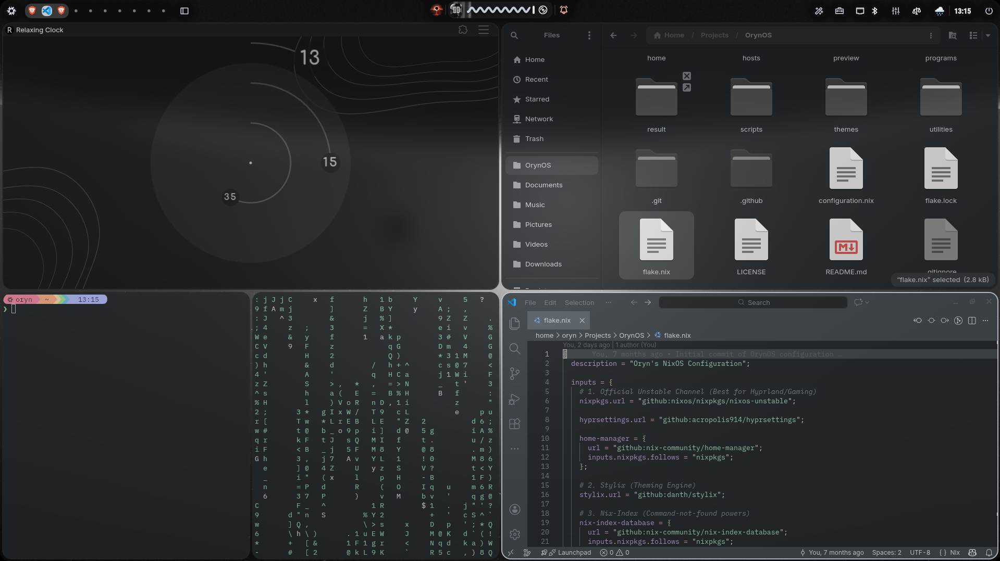
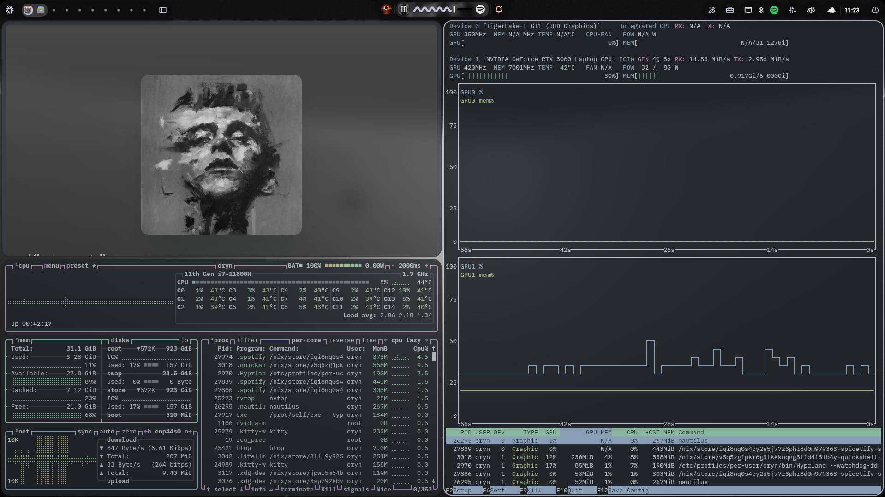

<div align="center">
<h1>
OrynOS
</h1>

<div align="center">
  
</div>

<h2 align="center">
  <em>Pure NixOS. Native Hyprland. Declarative to the core.</em>
</h2>


</div>

## Overview

**OrynOS** is a personal NixOS configuration built around a native Wayland stack.

Everything is declarative, modular, and meant to be understood.


---

## Characteristics

- Native **Hyprland** configuration
- System-wide theming via **Stylix**
- Modular system and Home Manager layout
- Shells installed via **Nix profiles** (intentionally non-declarative)
- NVIDIA hardware acceleration preconfigured

---

## Stack

| Component | Choice |
| :--- | :--- |
| **OS** | NixOS Unstable |
| **Compositor** | Hyprland |
| **Login** | greetd (TUI) |
| **Shell / Bar** | Ambxst (AGS) |
| **Theming** | Stylix (Base16) |
| **Terminal** | Alacritty + Kitty |
| **Browser** | Brave + Mullvad |

---

## Screenshots

<details>
<summary>📸 View</summary>
<br>

<div align="center">




</div>

</details>

---

## Install

> [!IMPORTANT]
> This assumes you already run NixOS and understand flakes.

**1. Enable flakes**

```nix
nix.settings.experimental-features = [ "nix-command" "flakes" ];
```

**2. Clone and build**

```bash
git clone https://github.com/OrynVail/OrynOS.git
cd ~/OrynOS

# Edit hardware config for your machine
nano hosts/oryn-nixos/hardware-configuration.nix

# Rebuild
sudo nixos-rebuild switch --flake .#oryn-nixos
```

Log in via greetd.

---

## Customisation

### 🎨 Theming

All theming flows from Stylix.

```nix
stylix = {
  enable = true;
  base16Scheme = "${pkgs.base16-schemes}/share/themes/ashes.yaml";

  image = ./wallpapers/wall.png;

  fonts.monospace = {
    package = pkgs.nerd-fonts.jetbrains-mono;
    name = "JetBrainsMono Nerd Font";
  };
};
```

Rebuild once. Everything follows.

### 🐚 Shells

Shells are installed via Nix profiles by design.

Swap freely. Update the Hyprland `exec-once` entry accordingly.

### 📦 Programs

Programs live as isolated modules.

```nix
{ pkgs, ... }: {
  home.packages = [ pkgs.your-package ];
}
```

Import. Rebuild.

---

## Maintenance

Standard maintenance workflow:

```bash
./scripts/oryn_cleanup.sh

nix flake update

sudo nixos-rebuild switch --flake .#oryn-nixos
```

Running unstable means breakage is part of the contract.

---

> [!NOTE]
> This repository reflects one system and one way of working. There are no guarantees beyond what NixOS already provides.

---

## License

MIT. See [LICENSE](LICENSE).

---

<div align="center">

<sub>❄️ Declarative by design. Unimpressed by convention.</sub>

</div>
