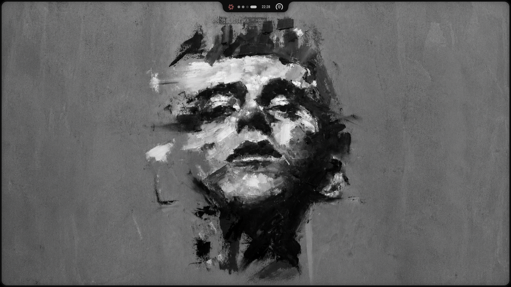
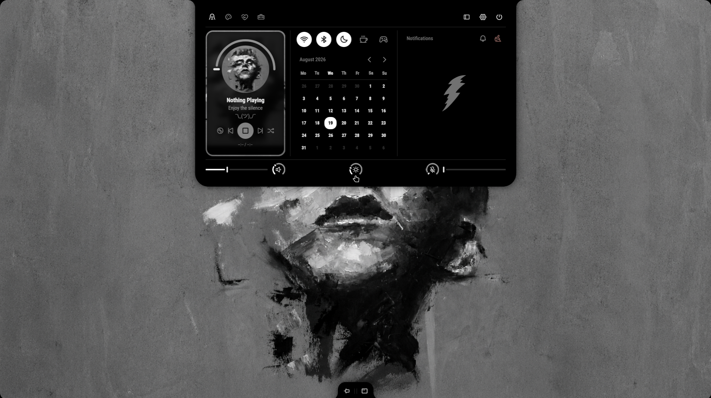
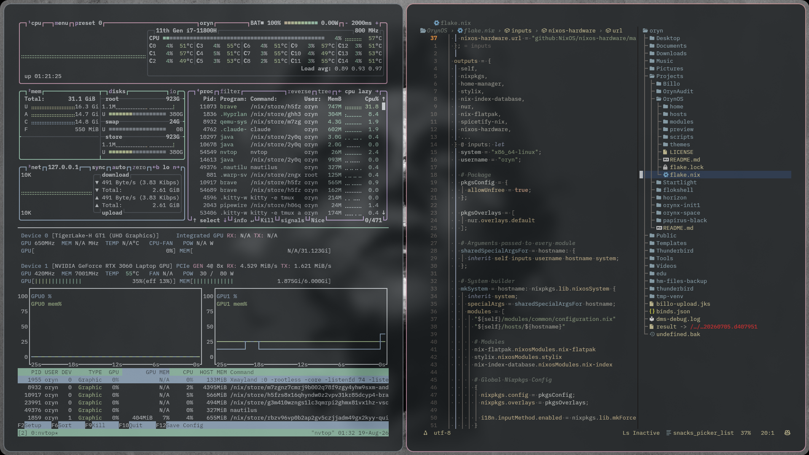

# OrynOS

<div align="center">
  
</div>

## Overview

A personal NixOS configuration on a native Wayland stack. The whole machine, in a file.

Declarative and modular, and written to be read.

---

## Characteristics

- Native **Hyprland** configuration
- System-wide theming via **Stylix**
- Modular system and Home Manager layout
- Shells installed via **Nix profiles** (intentionally non-declarative)
- NVIDIA hardware acceleration preconfigured

---

## Stack

|  |  |
|---|---|
| **OS** | NixOS Unstable |
| **Compositor** | Hyprland |
| **Login** | SDDM |
| **Theming** | Stylix (Base16) |
| **Terminal** | Kitty |
| **Browser** | Brave |

---

## Screenshots

<details>
<summary>View</summary>
<br>

<div align="center">




</div>

</details>

---

## Install

> [!IMPORTANT]
> This assumes you already run NixOS and understand flakes.

**1. Enable flakes**

```nix
nix.settings.experimental-features = [ "nix-command" "flakes" ];
```

**2. Clone and build**

```bash
git clone https://github.com/OrynVail/OrynOS.git
cd OrynOS

# Point this at your own hardware.
nano hosts/ph315/hardware-configuration.nix

sudo nixos-rebuild switch --flake .#ph315
```

There is one host and it is called `ph315`. Another machine wants its own directory under
`hosts/` and its own entry in `flake.nix`, not this one edited in place. Home Manager is
attached separately as `oryn@ph315`.

---

## Customisation

### Theming

All theming flows from Stylix.

```nix
stylix = {
  enable = true;
  base16Scheme = "${pkgs.base16-schemes}/share/themes/ashes.yaml";

  image = ./wallpapers/wall.png;

  fonts.monospace = {
    package = pkgs.nerd-fonts.jetbrains-mono;
    name = "JetBrainsMono Nerd Font";
  };
};
```

Rebuild once. Everything follows.

### Shells

Shells are installed via Nix profiles by design.

Swap freely. Update the Hyprland `exec-once` entry accordingly.

### Programs

Programs live as isolated modules.

```nix
{ pkgs, ... }: {
  home.packages = [ pkgs.your-package ];
}
```

Import. Rebuild.

---

## Maintenance

```bash
./scripts/oryn_cleanup.sh

nix flake update

sudo nixos-rebuild switch --flake .#ph315
```

Running unstable means breakage is part of the contract.

---

> [!NOTE]
> This repository reflects one system and one way of working. There are no guarantees beyond what NixOS already provides.

---

## License

MIT. See [LICENSE](LICENSE).
