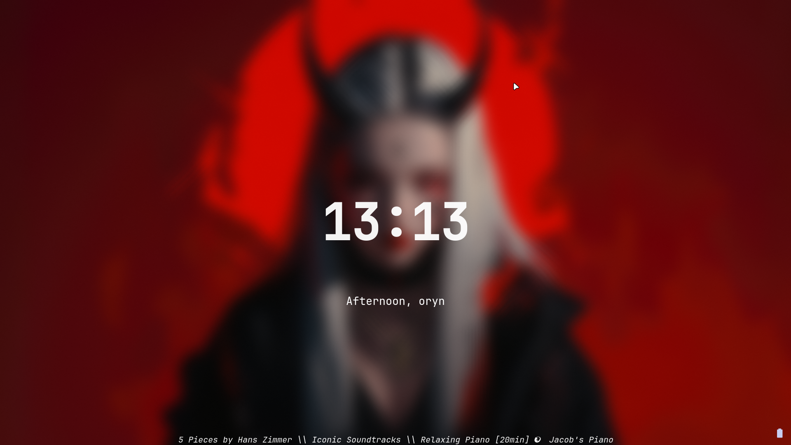
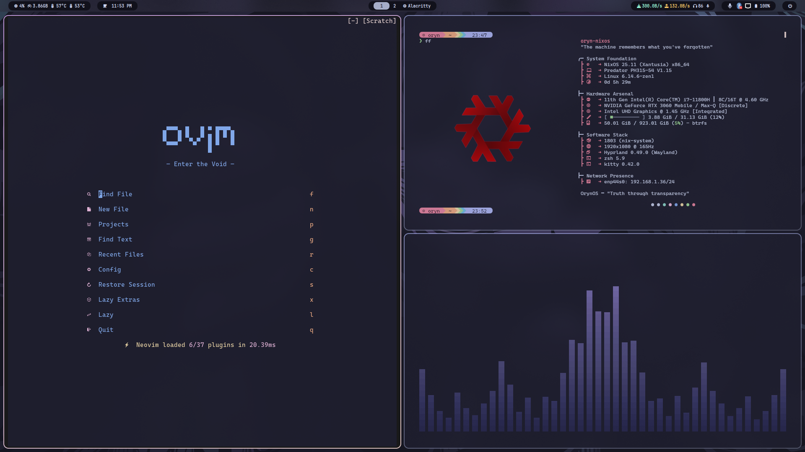
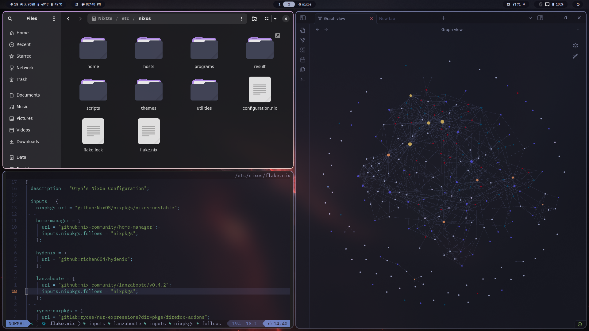
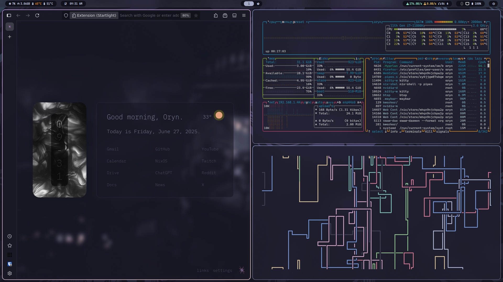

<h1 align="center">OrynOS - A Declarative Digital Sanctum</h1>

<p align="center">
  <em>"Within these lines, a digital world takes form,
  <br>Crafted with Nix, resilient to any storm."</em>
  <br><br>
  </p>
  

<div align="center">
  <a href="https://github.com/NixOS/nixpkgs/tree/nixos-unstable">
    
  </a>
  <a href="https://hyprland.org/">
    
  </a>
  <a href="https://github.com/OrynVail/OrynOS/blob/main/LICENSE">
    
  </a>
  <a href="https://github.com/OrynVail/OrynOS/stargazers">
    
  </a>
  <a href="https://github.com/OrynVail/OrynOS/commits/main">
    
  </a>
</div>


---

## 🌟 Overview

<div align="center" style="margin-bottom: 20px;">
  
</div>


Welcome, traveler, to the heart of **OrynOS** – a meticulously sculpted NixOS configuration that transcends mere dotfiles. This repository is the digital loom upon which a personalized, performant, sovereign, and perfectly reproducible computing experience is woven.

What began as a journey through various digital landscapes has culminated in this current form: a swift Hyprland session, launched directly from the bare TTY for uncompromised speed and display fidelity, built upon the robust foundation of the [Hydenix](https://github.com/richen604/hydenix) framework.

### 🎯 Key Features

| Feature | Description |
|---------|-------------|
| **🔄 Declarative** | Every configuration is code – reproducible and version-controlled |
| **⚡ Performance** | TTY-direct Hyprland for maximum speed and minimal overhead |
| **🔒 Sovereign** | Privacy-focused, telemetry-free, complete control |
| **🎨 Aesthetic** | True dark theme with the custom Helios color palette |
| **🧩 Modular** | Clean separation of concerns for maintainability |
| **🛡️ Secure** | Lanzaboote integration for UEFI Secure Boot |
| **🖌️ Themes** | swww Wallpaper daemon + Theme select + Rofi launcher select |
| **⚙️ System UI** | Wlogout + hyprlock + hypridle + Game Launcher |


---

## 📸 Gallery

<table align="center" style="border: none; margin-left: auto; margin-right: auto;"> <tr> <td align="center" width="33%" style="border: none; padding: 10px;">  <br> </td> <td align="center" width="33%" style="border: none; padding: 10px;">  <br> </td> <td align="center" width="33%" style="border: none; padding: 10px;">  <br> </td> </tr> </table>


---

## 🔮 Philosophy: Sovereignty Through Code

| Principle                   | Implementation                                                                           |
| --------------------------- | ---------------------------------------------------------------------------------------- |
| **🔄 Declarative Purity**   | System described, not configured – Nix translates descriptions into immutable reality    |
| **♻️ Reproducibility**      | Consistent builds across time and hardware – your environment as version-controlled code |
| **⚡ Performance & Control** | Direct TTY → Hyprland for raw speed and complete display dominion                        |
| **🧩 Modularity & Clarity** | Logical separation in `programs/`, `hosts/`, and `home/` for maintainable complexity     |
| **🔒 Digital Sovereignty**  | Freedom from telemetry, tracking, and opaque processes                                   |
| **🌑 Dark Aesthetic**       | Dark and deep aesthetic theme via custom Helios palette + Hydenix modules                |

---

## 🚀 Technology Stack


<div align="center">

<a href="https://nixos.org/">
  
</a>
<a href="https://nixos.wiki/wiki/Flakes">
  
</a>
<a href="https://github.com/nix-community/home-manager">
  
</a>

<a href="https://hyprland.org/">
  
</a>
<a href="https://wayland.freedesktop.org/">
  
</a>
<a href="https://en.wikipedia.org/wiki/Linux_console">
  
</a>

<a href="https://github.com/nix-community/lanzaboote">
  
</a>
<a href="https://en.wikipedia.org/wiki/UEFI">
  
</a>

</div>

---

## 🛠️ Quick Start

### Prerequisites

- NixOS with flakes enabled
- Home Manager (optional for user-only configs)

### Installation

```bash
# Clone the repository
git clone https://github.com/OrynVail/OrynOS.git
cd OrynOS

# Build and switch the NixOS system configuration
sudo nixos-rebuild switch --flake .#oryn-nixos

# Optional: Build standalone Home Manager configuration
home-manager switch --flake .#oryn@oryn-nixos
```

Customization
 * Hardware: Modify hosts/oryn-nixos/hardware-configuration.nix
 * Programs: Add/modify application configs in programs/
 * Host Settings: Customize system settings in hosts/oryn-nixos/default.nix

---

## 🔧 Maintenance

### Cleanup & Optimization

OrynOS includes custom maintenance scripts:

```bash
# Interactive system cleanup
./scripts/oryn_cleanup.sh (zsh alias="clean")

# System audit 
./scripts/oryn_audit.sh
```

### Updates

```bash
# Update flake inputs
nix flake update

# Rebuild with latest changes
sudo nixos-rebuild switch --flake .#oryn-nixos
```

---
## 📊 Statistics

<div align="center">


</div>


---
## 🤝 Contributing

Contributions are welcome! 
Ways to Contribute
 * 🐛 Report bugs or issues
 * 💡 Suggest new features or improvements
 * 📝 Improve documentation

---
## 📜 License

This project is licensed under the MIT License - see the [`LICENSE`](LICENSE) file for details.


---
## 🙏 Acknowledgments

 * NixOS Community - For the incredible ecosystem
 * Hydenix Framework - Foundation and inspiration
 * Hyprland - The amazing Wayland compositor

 ---
## 🌟 Support OrynOS

<h3 align=center>If you find this project useful, consider:</h3>
<div align="center">
<a href="https://github.com/OrynVail/OrynOS/stargazers">

</a>
</div>

<h4 align=center>❄️ by Oryn</h4>


